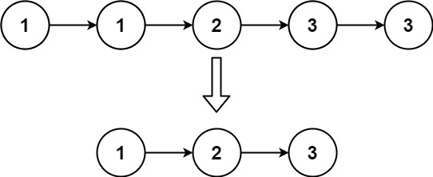

**Given the head of a sorted linked list, delete all duplicates such that each element appears only once. Return the linked list sorted as well.**

 
**Example 1:**


```swift
Input: head = [1,1,2]
Output: [1,2]
```


**Example 2:**



```swift
Input: head = [1,1,2,3,3]
Output: [1,2,3]
```

**Constraints:**
```swift
The number of nodes in the list is in the range [0, 300].
-100 <= Node.val <= 100
The list is guaranteed to be sorted in ascending order.
```

**Solution**
```swift
/**
 * Definition for singly-linked list.
 * public class ListNode {
 *     public var val: Int
 *     public var next: ListNode?
 *     public init() { self.val = 0; self.next = nil; }
 *     public init(_ val: Int) { self.val = val; self.next = nil; }
 *     public init(_ val: Int, _ next: ListNode?) { self.val = val; self.next = next; }
 * }
 */
class Solution {
    func deleteDuplicates(_ head: ListNode?) -> ListNode? {
        //
        guard let head = head else { return nil }
        var headNode: ListNode? = head
        //
        while(headNode != nil && headNode?.next != nil) {
            if headNode!.val == headNode!.next!.val {
                headNode!.next = headNode!.next!.next
            } else {
                headNode = headNode!.next
            }
        }
        //
        return head
    }
}
```
